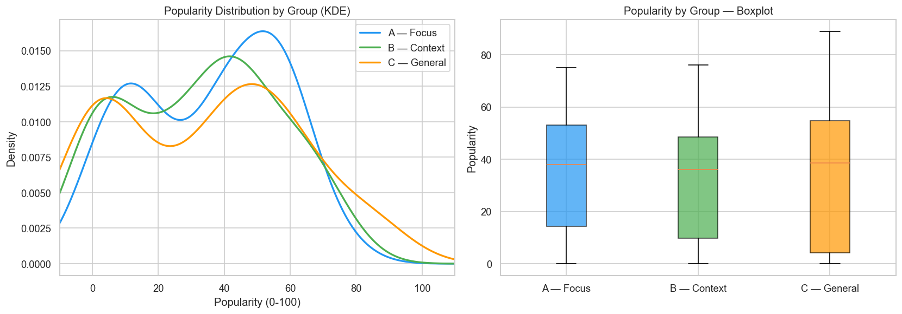
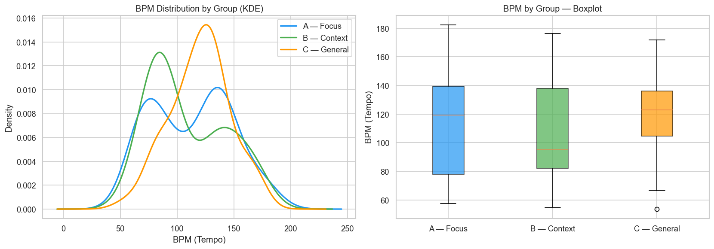
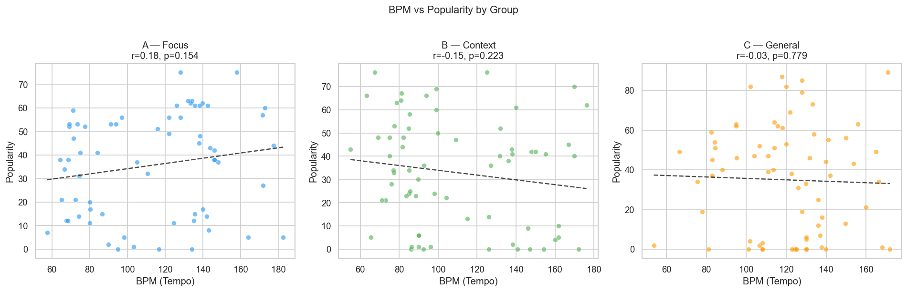

# Do Music Tempo and Focus Playlists Affect Listening Engagement?
### A/B Testing with Bayesian Analysis on Spotify/Musicae.io Data

Rigorous A/B testing framework applied to 2,016 tracks,
investigating whether "focus" tracks — associated with deep work, concentration,
and ADHD music — drive greater listening engagement than contextual relax/chill tracks,
as measured by Spotify popularity score.

Combines frequentist and Bayesian methods to answer a deceptively simple question:
**does high-tempo music actually keep you working longer, or are you just the kind
of person who seeks it out?**

## Research Question

Productivity culture recommends high-BPM music for focus and deep work. But does
tempo itself drive engagement — or is it a confound? People who build focused work
habits may self-select into focus playlists regardless of BPM. This project tests
whether focus music predicts engagement at scale using observational data.

## Dataset

**Source:** Musicae.io via RapidAPI (search + audio features + popularity)  
**Group A — Focus** (treatment, n=947): tracks matching queries like "ADHD focus music", "deep work music", "concentration beats"  
**Group B — Context** (control, n=1,069): tracks matching queries like "chill relax music", "coffee shop background music", "mellow instrumental"  
**Audio features:** `tempo` (BPM), `energy`, `valence`, `danceability`, `acousticness`, `instrumentalness`, `speechiness`, `loudness`  
**Outcome:** track `popularity` (Spotify's 0-100 engagement score)  
**Total tracks:** 2,016 (after removing 5 with invalid tempo=0)  
No audio files downloaded — metadata only. No personal user data involved.

## Data Pipeline

### Why Musicae.io?

Spotify deprecated its `/v1/audio-features` endpoint in November 2024 and restricted
playlist access and popularity data for new developer apps in February 2026.
Musicae.io is an independent API that replicates Spotify's deprecated endpoints
(audio features, track metadata, popularity) using Spotify track IDs.

The final pipeline uses **Musicae.io exclusively** for search, audio features, and popularity.
No Spotify API calls are needed.

### Design Decisions

**Why A/B instead of A/B/C?**
The original design included a third group (C — General) using queries like "top hits 2025".
EDA on the pilot data revealed that this group was poorly defined: the search queries
did not return reliably more popular tracks, making the group label misleading.
The effect size between C and other groups was negligible (d<0.08), so C was dropped.

**Why these two groups?**
A vs B is the most meaningful comparison: both groups represent contextual listening
(music chosen for a specific activity), but only A has explicit focus/work intent.
This isolates the focus intent effect while controlling for "background listening" behavior.

### Pilot Study & Sequential Design

Rather than assuming an effect size upfront, we followed a sequential design:

1. **Pilot** — collected ~70 tracks per group, computed Cohen's d on popularity
2. **Power analysis** — used observed d to calculate required sample size
3. **Scale up** — collected full sample based on power requirements

| Phase | n per group | Cohen's d | Power |
|-------|-------------|-----------|-------|
| Pilot | ~68 | 0.114 | ~0.30 |
| Full sample | 947 / 1,069 | 0.175 | **0.967** |

The pilot underestimated the true effect size — a known limitation of small pilots.
With the full dataset we have 96.7% statistical power, well above the 0.80 minimum.

## Preliminary EDA Findings

| | A — Focus | B — Context |
|---|---|---|
| Mean BPM | 112.2 | 110.3 |
| Mean popularity | 28.5 | 31.9 |
| Mean energy | 0.264 | 0.434 |
| Mean instrumentalness | 0.588 | 0.360 |

**Key observations:**
- BPM is nearly identical between groups — focus music is not faster than context music
- Context/relax music is slightly more popular than focus music (31.9 vs 28.5) — but since BPM is nearly identical between groups (110 vs 112), tempo does not appear to be the driver of engagement
- Focus tracks are highly instrumental and low energy — they differ from context tracks in many features beyond tempo
- This suggests confounding: the groups differ not just in BPM but in multiple audio dimensions

## Analyses

### Notebook 1 — EDA & Power Analysis ✅




- Popularity distributions nearly identical across groups
- BPM does not differ meaningfully between focus and context tracks
- No significant correlation between BPM and popularity within any group
- Power analysis: d=0.175, current power=0.967 with full sample

### Notebook 2 — Frequentist A/B Test
- Mann-Whitney U test: does popularity differ significantly between A and B?
- Effect size (rank-biserial r) for practical significance
- Subgroup analysis by audio feature clusters
- Multiple testing correction (Bonferroni)

### Notebook 3 — Bayesian A/B Test
- Beta-Binomial conjugate model on binary engagement outcome
- Posterior distribution for P(focus > context)
- Credible intervals for lift in popularity

### Notebook 4 — Predictive Modeling
- Binary outcome: does a track exceed median popularity threshold?
- Models: Logistic Regression, Random Forest, Gradient Boosting
- SHAP analysis: where does `tempo` rank among all audio features?
- Key question: after controlling for energy, instrumentalness, and speechiness —
  how much unique predictive power does BPM contribute?

## The Twist

Focus tracks are not faster than context tracks. And context/relax music is
more popular than focus music. When predictive modeling controls for energy,
instrumentalness, and other audio features, the independent contribution of BPM
is expected to be minimal.

**The lesson mirrors a parallel project on clinical trial enrollment nudges:**
observational data can make an intervention look meaningful until you account for
what else differs between treatment and control groups.

> Correlation ≠ causation — whether you're running clinical trials or building a
> focus playlist.

## Stack

- **Python, pandas** — data ingestion and processing
- **requests** — Musicae.io API calls via RapidAPI
- **scipy, statsmodels** — frequentist hypothesis testing, power analysis
- **scikit-learn, SHAP** — predictive modeling
- **Matplotlib, seaborn** — visualizations
- **JupyterLab** — documented analysis notebooks

## Project Structure

```
beats-and-focus/
├── data/
│   ├── raw/          # track metadata + audio features (not tracked in git)
│   └── processed/    # cleaned dataset (not tracked in git)
├── notebooks/
│   ├── 01_eda.ipynb          ✅
│   ├── 02_frequentist.ipynb
│   ├── 03_bayesian.ipynb
│   └── 04_predictive.ipynb
├── figures/          # saved plots
├── src/
│   └── ingest.py     # Musicae.io ingestion pipeline
├── .env              # API credentials (not tracked)
├── requirements.txt
├── .gitignore
└── README.md
```

## Setup

```bash
git clone https://github.com/KelyNorel/beats-and-focus.git
cd beats-and-focus
pyenv virtualenv 3.11 beats-and-focus
pyenv activate beats-and-focus
pip install -r requirements.txt
```

Add your API credentials to `.env`:

```
RAPIDAPI_KEY=your_rapidapi_key
RAPIDAPI_HOST=spotify-extended-audio-features-api.p.rapidapi.com
```

Then run the ingestion pipeline:

```bash
python src/ingest.py
```

---

**Author:** Raquel (Kely) Norel, PhD  
**Domain:** Behavioral Data Science / A/B Testing / Music & Productivity  
**Companion project:** [clinical-trial-nudges](https://github.com/KelyNorel/clinical-trial-nudges) — same methods, higher stakes  
**Status:** 🚧 In progress — Notebook 1 complete, Notebooks 2-4 pending
